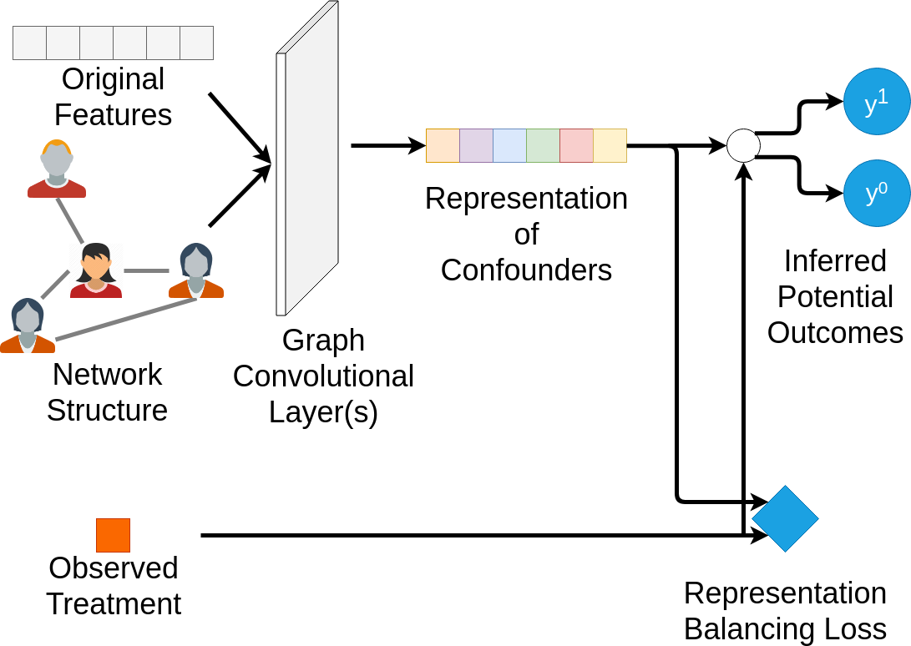

# network-deconfounder-wsdm20
Code for the WSDM '20 paper, [Learning Individual Causal Effects from Networked Observational Data](https://arxiv.org/abs/1906.03485).

**First Work on Causal Effect Estimation Based on Graph Convolutional Neural Networks**

For now, please cite the WSDM version if you find this paper/repository is helpful.
```
@inproceedings{guo2020learning,
  title={Learning Individual Causal Effects from Networked Observational Data},
  author={Guo, Ruocheng and Li, Jundong and Liu, Huan},
  booktitle={Proceedings of the 13th International Conference on Web Search and Data Mining},
  pages={232--240},
  year={2020}
}
```

### Overview of the Network Deconfounder



### Dependencies

Tested on Ubuntu 18.04

```
Python 3.6
Pytorch 1.2.0
Scipy 1.3.1
Numpy 1.17.2
Pandas 0.25.1
```

### Datasets

Datasets used in this paper can be found in ```./datasets```

### Running the experiment

On a linux system, you can run the bash script, for example

```
bash run_for_share.sh --dataset BlogCatalog
```

Then results would be added to the end of the corresponding csv files in ./new_results/Blogcatalog or ./new_results/Flickr

To calculate the mean of the results from 10 simulations, you can use the python script

```
python res_mean.py
```
